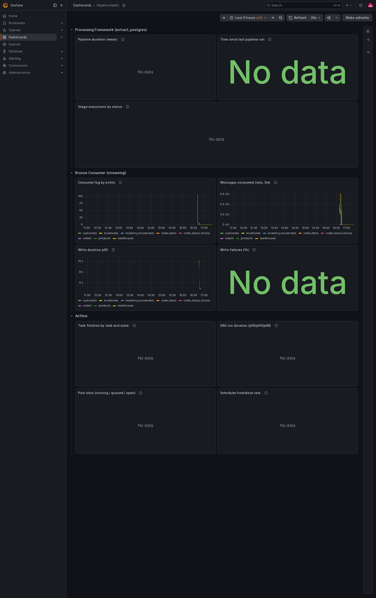
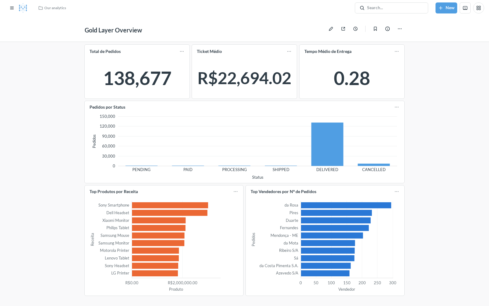

# Modern Data Platform


<p align="center">

**A cloud-agnostic, event-driven Modern Data Platform built with open-source technologies and production-ready engineering practices.**

Design and implementation inspired by real-world enterprise data platforms.

</p>

---

**Aroldo Brancalhão Junior**
[LinkedIn](https://www.linkedin.com/in/aroldo-brancalhao-junior/) · [GitHub](https://github.com/aroldobrancalhao) · [aroldobrancalhaojunior@gmail.com](mailto:aroldobrancalhaojunior@gmail.com)

---

## Overview

Modern Data Platform is an end-to-end Data Engineering project designed to demonstrate how production-grade data platforms are built.

The project covers the complete lifecycle of modern analytical data:

- Change Data Capture (CDC)
- Event Streaming
- Distributed Processing
- Lakehouse Architecture
- Data Modeling
- Infrastructure as Code
- Observability
- CI/CD

Rather than focusing on a single technology, this project emphasizes software engineering principles, modular architecture, and cloud portability.

---

# Engineering Highlights

A sample of the real bugs and incidents this project surfaced and
resolved — the full investigation, evidence, and validation for each
lives in `docs/architecture/roadmap-next-steps.md`, this project's
running engineering log.

- Traced 139 duplicate rows in a downstream BI table back through three system layers (the source database, the storage transaction log, and the CDC decoder) to one physical table two independent writers didn't know they shared — split it, fixed at the root instead of patched downstream. ([details](docs/architecture/roadmap-next-steps.md))
- Found a retry bug that could loop forever reprocessing the same failed message, caught live mid-reprocessing of 16 parallel data streams, and fixed it the same day. ([details](docs/architecture/roadmap-next-steps.md))
- Investigated a real AWS cost spike, identified the exact driver, shut it off, and added budget alerts plus automated cost-anomaly detection so it can't recur unnoticed. ([details](docs/architecture/roadmap-next-steps.md))
- Found that a monitoring alert believed to be working had actually never fired once, traced it to a subtle metrics-counter edge case, fixed it, and proved the fix by triggering a real failure end to end. ([details](docs/architecture/roadmap-next-steps.md))
- Found a pipeline stage burning most of its runtime reinstalling dependencies on every single run instead of processing data, and eliminated the redundant work at the source. ([details](docs/architecture/roadmap-next-steps.md))
- Diagnosed a data pipeline silently stuck for 9 hours with zero errors logged, down to one unguarded network call, using log archaeology and direct evidence rather than guesswork. ([details](docs/architecture/roadmap-next-steps.md))
- An event-driven trigger's own self-restart logic re-fired the same already-handled signal 188 times in 30 minutes (2 runs reached real cloud compute) because the detection query had no memory of what it had already acted on -- replaced the rolling time window with a value watermark, then proved the fix by triggering the exact failure scenario twice in a row and confirming the second trigger correctly did nothing. ([details](docs/architecture/roadmap-next-steps.md))

<!-- TODO: screenshot -- Grafana "Pipeline Health" dashboard
     URL: http://localhost:3000/d/mdp-pipeline-health (admin / the
     value of GRAFANA_ADMIN_PASSWORD in infrastructure/docker/.env)
     Should show: the full panel grid with real data visible across
     all 3 metric sources (processing framework, Airflow, Bronze
     Consumer) -- not an empty or "No data" state, so run the
     simulator + bronze-consumer for a few minutes first.
     Save as: docs/images/grafana-pipeline-health.png
     Then replace this comment with:
     
-->

---

# Architecture Goals

The platform was designed around a few fundamental principles.

- Cloud-agnostic architecture
- Event-driven communication
- Infrastructure as Code
- Modular design
- Provider-based abstractions
- Reproducible environments
- High testability
- Production-ready practices

More details are available in the Architecture Decision Records (ADRs).

---

# High-Level Architecture

```text
                 Source Systems
                        │
                        ▼
                 PostgreSQL
                        │
                        ▼
                 Debezium (CDC)
                        │
                        ▼
                  Apache Kafka
                        │
                        ▼
                Apache Airflow
                        │
                        ▼
              Platform Abstractions
                        │
        ┌───────────────┼────────────────┐
        ▼               ▼                ▼
    Storage         Compute         Messaging
        │               │                │
        ▼               ▼                ▼
      Amazon S3     Databricks       Kafka/MSK
                        │
                        ▼
                 Apache Spark
                        │
              ┌─────────┴─────────┐
              ▼                   ▼
           Bronze               Silver
         (Delta Lake)         (Delta Lake)
                                   │
                                   ▼
                            Glue Catalog
                                   │
                                   ▼
                                  dbt
                                   │
                                   ▼
                                 Gold
                                   │
                                   ▼
                            Amazon Athena
                          ┌────────┴─────────┐
                          ▼                  ▼
                       Metabase           Power BI
```

Databricks/Spark's responsibility ends at Silver; Gold is dbt's
responsibility, reading Silver through the Glue Catalog (see
ADR-011).

---

# Technology Stack

| Layer | Technology |
|--------|------------|
| Programming Language | Python 3.12 |
| Structured Logging | structlog |
| Database | PostgreSQL |
| CDC | Debezium |
| Streaming | Apache Kafka |
| Workflow Orchestration | Apache Airflow |
| Distributed Processing | Apache Spark |
| Compute Platform | Databricks |
| Data Access / Governance | Unity Catalog (Storage Credential + External Location) |
| Object Storage | Amazon S3 |
| Table Format | Delta Lake |
| Data Modeling | dbt |
| Query Engine | Amazon Athena |
| Visualization | Metabase (containerized), Power BI |
| Infrastructure as Code | Terraform |
| Containers | Docker |
| Version Control | GitHub |

---

# Project Structure

```text
modern-data-platform/

├── docs/
│   └── architecture/
│
├── infrastructure/
│   ├── terraform/
│   ├── docker/
│   └── databricks/
│
├── src/
│   ├── common/
│   ├── data_platform/
│   │   ├── catalog/
│   │   ├── compute/
│   │   ├── config/
│   │   ├── contracts/
│   │   ├── datalake/
│   │   ├── enums/
│   │   ├── exceptions/
│   │   ├── http/
│   │   ├── identity/
│   │   ├── messaging/
│   │   ├── models/
│   │   ├── monitoring/
│   │   ├── notifications/
│   │   ├── observability/
│   │   ├── processing/
│   │   ├── providers/
│   │   ├── security/
│   │   ├── storage/
│   │   ├── types/
│   │   └── workflow/
│   ├── integrations/
│   ├── quality/
│   ├── simulator/
│   └── streaming/
│
├── airflow/
├── alembic/
├── dbt/
├── notebooks/
├── scripts/
└── tests/
```

---

# Repository Modules

`src/`'s real top-level structure, per ADR-013 (which supersedes
ADR-001's and ADR-004's original module lists — both predated the
codebase's actual growth and, in one case, described a package that
no longer exists).

## `data_platform/`

Infrastructure-independent abstractions: storage, compute, messaging,
config, monitoring, security, catalog, and the provider contracts
(`*Provider` ABCs) everything above builds on. By far the largest
package — see ADR-013 for its full submodule list.

## `integrations/`

Per-integration client code: `kafka/`, `postgres/`, `airflow/`,
`aws/`, `databricks/`.

## `quality/`

Data quality: `expectations/`, `profiling/`, `validators/`.

## `simulator/`

Synthetic marketplace data generator (`core/`, `domain/`) — the
source system this whole pipeline runs against.

## `streaming/`

Kafka consumers, producers, schemas — the Bronze Consumer (real-time
CDC ingestion) lives here.

## `common/`

Shared constants and utilities.

---

# Data Flow

```text
Simulator

↓

PostgreSQL

↓

Debezium

↓

Kafka

↓

Airflow

↓

S3

↓

Spark

↓

Bronze

↓

Silver

↓

Glue Catalog

↓

dbt

↓

Gold

↓

Athena

↓

Power BI
```

---

# Cloud Strategy

The platform follows a capability-based architecture.

Business logic never depends directly on cloud providers.

| Capability | AWS | Azure | GCP |
|------------|-----|--------|-----|
| Storage | S3 | ADLS Gen2 | GCS |
| Compute | Databricks / EMR | Databricks / Synapse | Databricks / Dataproc |
| Messaging | Kafka / MSK | Event Hubs | Pub/Sub |
| Monitoring | CloudWatch | Azure Monitor | Cloud Monitoring |
| Secrets | Secrets Manager | Key Vault | Secret Manager |

Provider-specific implementations are isolated behind platform contracts.

---

# Development Principles

- Infrastructure as Code
- Cloud Agnostic
- Provider Pattern
- Layered Architecture
- Dependency Injection
- Type Safety
- Automated Testing
- Continuous Integration

---

# Quick Start

## Clone the repository

```bash
git clone https://github.com/aroldobrancalhao/modern-data-platform.git

cd modern-data-platform
```

## Install dependencies

```bash
uv sync --all-extras
```

`--all-extras` pulls in `orchestration`/`warehouse`/`streaming`
(Airflow, dbt, confluent-kafka) alongside the core dependencies --
split out of `[project.dependencies]` so the Databricks notebooks'
wheel install (`uv build --wheel`, `infrastructure/databricks/
databricks.yml`) doesn't pull in Airflow's/dbt's/Kafka's dependency
trees, none of which those notebooks import. Local dev needs all of
it; plain `uv sync` (no `--all-extras`) now leaves those three out.

## Start local infrastructure

```bash
cp infrastructure/docker/.env.example infrastructure/docker/.env
# fill in the real values (AWS/Databricks/Telegram/SMTP credentials, etc.)
# -- see that file's own comments for where each one comes from.
docker compose up -d
```

`infrastructure/docker/.env` is gitignored (real credentials never
committed) -- `.env.example` documents every variable the stack
actually reads today, kept in sync with it. This is separate from the
repo-root `.env` (already present, application/simulator config only
-- Postgres connection, simulator batch sizes, etc.), not the compose
stack's own.

The local environment includes:

- PostgreSQL (marketplace database + Airflow metastore)
- Kafka (+ Kafka UI)
- Debezium
- Airflow
- Redis (Celery broker for Airflow)
- Bronze Consumer (containerized, see "Run the Bronze Consumer" below)
- Prometheus + Grafana + Pushgateway + statsd-exporter (see "Phase 6 — Observability")

## Apply database migrations

```bash
uv run alembic upgrade head
```

The `marketplace` schema's initial 17 tables come from
`infrastructure/docker/postgres/init/*.sql`, run automatically by
Postgres on first container boot -- Alembic (`alembic/`, `alembic.ini`
at the repo root) takes over from there for every change after that,
over `postgresql+psycopg://` (psycopg v3), the same driver as the rest
of the app.

## Run the simulator

```bash
PYTHONUNBUFFERED=1 uv run python -m simulator.app > /tmp/simulator.log 2>&1 &
```

`pyproject.toml` now has a real `[build-system]` (hatchling,
`[tool.hatch.build.targets.wheel]` listing every real `src/` package),
so `uv sync` installs the project itself in editable mode and every
`src/` package (`simulator` included) is importable without
`PYTHONPATH` -- confirmed live: every package imports cleanly with
`PYTHONPATH` unset, and `pytest`'s own `pythonpath = ["src"]` override
(no longer needed either) was dropped. See "`src/` packages aren't
installable -- `PYTHONPATH` required outside pytest" in
`docs/architecture/roadmap-next-steps.md` for the history of this gap.

An unhandled exception still kills the process (there is no top-level
retry/supervisor loop), matching the exit code you'll see if it dies.
Faker-uniqueness exhaustion and cross-run unique-constraint collisions
are handled (`unique_or_fallback`, `insert_with_unique_retry`), so
those specific cases no longer crash the process -- but any other
unexpected failure (e.g. Postgres becoming unreachable) still will.
Run it with `PYTHONUNBUFFERED=1` (or `python -u`): Python
block-buffers stdout when it isn't a TTY, so without this a crash can
lose its own traceback in an unflushed buffer, leaving the log looking
like it died silently mid-line with no error at all. This doesn't fix
the underlying failure -- it just guarantees you can see why it
failed.

## Run the Bronze Consumer

Runs as its own container (`bronze-consumer`, `infrastructure/docker/streaming/Dockerfile`)
as part of `docker compose up -d` -- no separate step needed. It's a
plain `python:3.12-slim` image with the project's own dependencies
installed via `uv sync` from `pyproject.toml`/`uv.lock` (code `COPY`'d
in, not volume-mounted -- rebuild the image, `docker compose build
bronze-consumer`, after a `src/` change under it).

For local iteration without a rebuild, run it directly instead:

```bash
uv run python scripts/run_bronze_consumer.py
```

Long-running process: consumes Debezium change events for all 16
streaming entities directly off Kafka and writes them to their Bronze
Delta tables via `deltalake` (no Spark) -- the streaming half of
ADR-0008's flow, independent from Airflow. Stop with Ctrl+C.

Validated end to end against real Postgres/Debezium/Kafka/Delta (see
`tests/integration/kafka/test_bronze_consumer_real_kafka.py`, run with
`-m real_kafka`). This phase's known limitations -- no Dead Letter
Queue, no distributed lock against the batch flow writing the same
Bronze tables, deletes landing as regular appends rather than deletes
(the domain already soft-deletes via `deleted_at`), and a round-robin
poll loop that is throughput-bound under a large backlog (see
`docs/architecture/roadmap-next-steps.md`) -- are documented in
`src/streaming/consumers/bronze_consumer.py`'s module docstring.

Exposes Prometheus metrics on `:9200/metrics` (write duration, records
written, write failures, messages consumed, consumer lag -- see
"Phase 6 — Observability" below); the container's own AWS credentials
need `AWS_REGION`/`AWS_DEFAULT_REGION` set explicitly (unlike the rest
of the project's S3 access, which goes through boto3 --
`write_deltalake()`'s pure-Rust S3 client doesn't follow a
cross-region redirect the way boto3 does).

## Databricks authentication (local)

`DatabricksComputeProvider` delegates authentication entirely to the
official Databricks SDK credential chain (`~/.databrickscfg`,
`DATABRICKS_HOST`/`DATABRICKS_TOKEN`, Azure CLI, etc). By default it
doesn't force any profile, so it depends on either your local
`~/.databrickscfg` having a `default_profile` set, or the
`DATABRICKS_CONFIG_PROFILE` environment variable being exported in
your shell -- this project's profile is `modern-data-platform`, not
`DEFAULT`:

```bash
export DATABRICKS_CONFIG_PROFILE=modern-data-platform
```

To make the profile deterministic regardless of what your personal
`~/.databrickscfg` resolves to (e.g. on a machine/CI runner without a
`default_profile` set), pass it explicitly via `DatabricksSettings`
instead of relying on the environment:

```python
from integrations.databricks.config.databricks_settings import DatabricksSettings
from integrations.databricks.core.databricks_context import DatabricksContext

context = DatabricksContext(DatabricksSettings(profile="modern-data-platform"))
```

---

# Documentation

Architecture documentation is located in:

```text
docs/architecture/
```

Current ADRs:

- ADR-000 – Architecture Principles
- ADR-001 – Platform Architecture
- ADR-002 – Platform Contracts
- ADR-003 – Cloud Strategy
- ADR-004 – Repository Structure
- ADR-005 – Development Standards
- ADR-006 – Platform Capability Model
- ADR-007 – Workflow Capability
- ADR-0008 – Batch vs Streaming Processing Architecture
- ADR-009 – Adopt Processing Framework
- ADR-010 – Capability-Based Shared Execution Context
- ADR-011 – Gold Modeling Moves to dbt
- ADR-012 – Agent Layer as a Separate, Connected Project
- ADR-013 – `src/` Module Structure, Reconciled With Reality

---

# Business Intelligence

Two BI integrations against the same Gold layer over Athena, tool-agnostic by design: dbt models the star schema once (`dbt/models/gold/`), any BI tool queries it independently through Athena, none of them tied to how the other connects.

## Metabase (containerized, done)

- `metabase` + `postgres-metabase` services (`infrastructure/docker/docker-compose.yml`) -- `http://localhost:3001`.
- Authenticates as a dedicated, read-only IAM User (`mdp-bi-reader-dev`, Terraform `module.bi_reader`), not `terraform-admin` -- scoped to the Gold database/tables, the `gold/` S3 prefix, and its own dedicated Athena staging bucket.
- First real dashboard, **Gold Layer Overview** (`http://localhost:3001/dashboard/2`): total orders, orders by day, top products by revenue, top sellers by order count, average order value. Built via the Metabase API using Native Query (SQL), not the visual builder, so every question is versioned as plain text instead of living only in Metabase's own metadata database -- see `dashboards/metabase/` (SQL sources, data-cardinality caveats, and a from-scratch recreation procedure, since Metabase's Serialization/export feature is Pro-only).

<!-- TODO: screenshot -- Metabase "Gold Layer Overview" dashboard
     URL: http://localhost:3001/dashboard/2 (log in with the Metabase
     admin account created on first setup)
     Should show: all 5 questions with real data rendered (total
     orders, orders by day, top products by revenue, top sellers by
     order count, average order value) -- not an empty dashboard, so
     run the simulator and let the full pipeline land some Gold data
     first.
     Save as: docs/images/metabase-gold-layer-overview.png
     Then replace this comment with:
     
-->

## Power BI (connected, dashboard not built)

Connects to the same `mdp-bi-reader-dev` IAM User and `mdp-athena-dev` workgroup as Metabase -- no new IAM identity needed, by design (both BI tools share one read-only access boundary). Validated via the official AWS Athena ODBC driver + a DSN, Power BI Desktop (Import mode): real rows confirmed for `fact_orders`/`dim_customers`/`dim_products`. No dashboard built yet; Power BI Service + an On-premises Data Gateway for scheduled refresh considered as the next step, not started. See `docs/architecture/roadmap-next-steps.md` for the full investigation, including two real driver/DSN bugs hit and fixed along the way (a Store-app ODBC DSN-visibility bug, a driver checksum-validation bug).

---

# Project Roadmap

Status legend: ✅ Done — 🔶 Partial — ⬜ Not started.

## Phase 1 — Foundation

- ✅ Repository structure, Docker environment (Postgres, Kafka, Debezium, Airflow, Redis), Terraform foundation applied (`dev`: S3, Glue databases, Athena workgroup, Unity Catalog IAM trust).

## Phase 2 — CDC

- ✅ PostgreSQL, Debezium, Kafka, and a streaming Bronze Consumer (continuous Kafka consumer, no Spark, independent from Airflow) all validated end to end against real infrastructure.
- ✅ Real Airflow DAG (`marketplace_batch_pipeline`) orchestrating Postgres extraction → Databricks → dbt, validated live. `schedule=None` -- a 30-minute fixed schedule was tried and validated live, then reverted the same day after driving a real AWS cost spike with no matching freshness need.
- ✅ Event-driven trigger (`order_status_history_lag_watcher`): fires `marketplace_batch_pipeline` only when there's real new `order_status_history` data to pick up, instead of checking on a fixed interval -- self-restarting, no manual re-trigger needed in normal operation. Watermarked (see Engineering Highlights) to guarantee each real signal fires exactly once.

## Phase 3 — Data Lake

- ✅ Postgres → `raw/` → Bronze → Silver, validated end to end for all 7 core entities; Bronze split into independent streaming and batch physical tables (root-caused a real duplicate-row bug, see Engineering Highlights); daily `OPTIMIZE`/`VACUUM` automated via its own Airflow DAG.

## Phase 4 — Data Modeling

- ✅ dbt star schema (staging → intermediate → dimensions/facts) against Athena/Glue, `dbt run`/`dbt test` green.
- ✅ Order status history modeled through to Gold: `stg_order_status_history`, `fact_order_status_transitions` (one row per status transition, time-in-previous-status), and `fact_orders` extended with `delivered_at` -- 19/19 tests passing, validated against real production data (138k+ orders): 4.97% cancellation rate, 0.28h average delivery time.
- ⬜ Metrics layer.

## Phase 5 — Analytics

- 🔶 Metabase dashboard live and versioned as code; Power BI connected and validated, dashboard not built yet.
- ⬜ Business KPIs.

## Phase 6 — Observability

- ✅ Structured logging (CloudWatch + local), Prometheus metrics across the processing framework/Airflow/Bronze Consumer, a Grafana dashboard, and 4 alert rules fanning out to Telegram + email -- all validated against real, induced failures, not just configured.

## Phase 7 — CI/CD

- ⬜ GitHub Actions, automated testing wired into CI, deployment.

Full change log, root-cause investigations, and validation evidence for every item above: `docs/architecture/roadmap-next-steps.md`.

---

# Future Improvements

Planned enhancements include:

- Azure implementation
- Google Cloud implementation
- Apache Iceberg
- OpenLineage
- DataHub
- Kubernetes deployment
- Feature Store
- Machine Learning pipelines

---

# Contributing

Contributions are welcome. There is no separate `CONTRIBUTING.md` yet
-- this section is the contributing guideline until one exists.

## Keeping the README in sync with the architecture

Any structural architecture change must update this README in the
same commit, or in a commit immediately following it -- divergence
between this document and the real state of the project should never
be allowed to accumulate. This applies to changes such as:

- A data format or table format change (e.g. adopting/dropping Delta Lake, Iceberg)
- A catalog or query engine change (e.g. Glue/Athena replaced or supplemented)
- A new capability or integration (e.g. a new cloud provider, a new messaging system)
- A Project Roadmap phase moving from not-started to partial/done, or vice versa

When in doubt about whether a change is "structural" enough to require this, err on the side of updating the README.

---

# License

This project is licensed under the MIT License.

See the LICENSE file for details.

---

# Acknowledgements

This project was inspired by modern data engineering practices and the architecture of enterprise-grade data platforms.

Special thanks to the open-source community behind:

- Apache Airflow
- Apache Kafka
- Apache Spark
- dbt
- Terraform
- Docker
- Debezium
